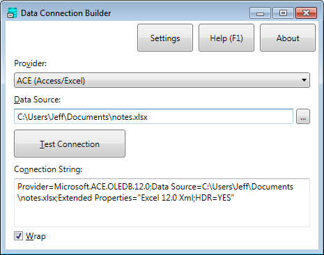

Data Connection Builder is a free and open-source Windows application that provides a convenient way to build [ActiveX Data Objects (ADO)](https://docs.microsoft.com/en-us/sql/ado/microsoft-activex-data-objects-ado) connection strings.  ADO connection strings are often embedded in configuration files for .NET applications that connect to databases on the back end.  There may also be occasions when end users need to build ADO connection strings for various reasons.  Data Connection Builder is essentially a dialog box that prompts the user for the parameters necessary to establish a connection to a data source, and provides the user with an ADO connection string for that data source connection.

Like all of my .NET apps, Data Connection Builder requires the [JBCore library](https://github.com/jeffbourdier/JBCore), also hosted here on GitHub.
